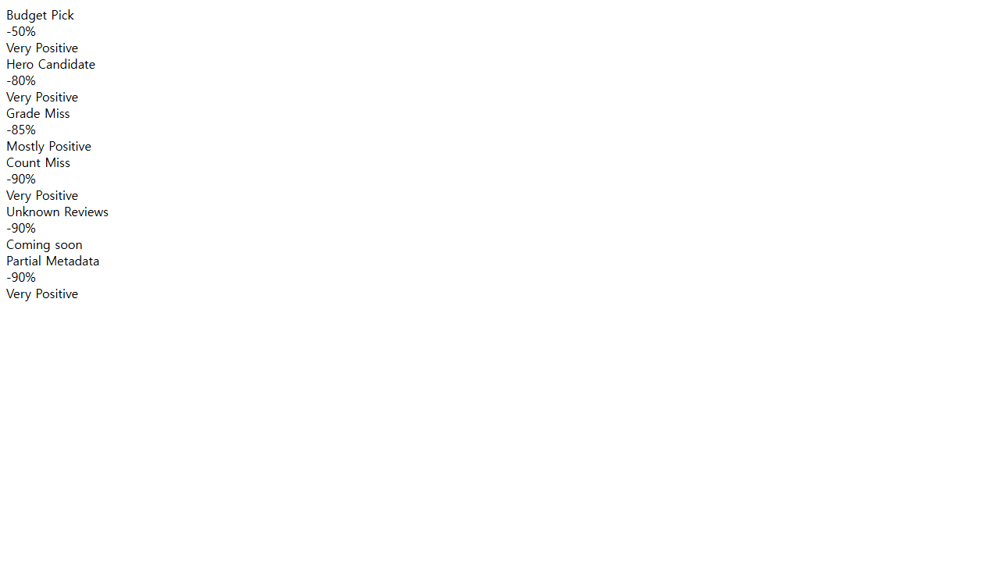

# steam-sales-per

## 한국어

`steam-sales-per`는 Windows에서 동작하는 Steam 데스크톱 클라이언트용 품질 필터 도구입니다.  
Steam Store/특가 페이지에서 할인율만이 아니라 리뷰 수, 평가 등급, 보유 여부, DLC 여부까지 기준으로 카드 표시를 줄일 수 있습니다.

### 주요 기능

- 품질 기준 필터
  - 최소 할인율
  - 최소 리뷰 수
  - 최소 평가 등급
- 표시 규칙 토글
  - 할인율을 읽지 못한 제품 표시/숨김
  - 신뢰할 리뷰 데이터를 읽지 못한 제품 표시/숨김
  - 이미 보유한 제품 표시/숨김
  - DLC 제품 표시/숨김
- 프리셋
  - Deep Sale Hits
  - Safe Bets
  - Hidden Gems-ish
  - 프리셋에서 수동으로 값 변경 시 `Custom` 상태로 전환
- 상태/진단
  - 적용 중, 적용 완료, 0개 결과, 부분 메타데이터, 구조 경고 등 상태 표시
- 다국어 UI
  - 한국어 / English / 日本語
- Steam 실행 지원
  - Steam 설치 경로 자동 탐색
  - `-cef-enable-debugging` 옵션으로 Steam 실행 시도

### 사용 방법

1. GitHub Releases에서 `steam-sales-per.exe`를 다운로드합니다.
2. exe를 실행합니다.
3. 로컬 제어 패널에서 필터 값을 조정합니다. 변경은 즉시 적용됩니다.
4. Steam Store 또는 Specials 페이지를 열면 필터가 반영됩니다.

기본값:

- 필터 사용: 켜짐
- 최소 할인율: 75%
- 최소 리뷰 수: 500
- 최소 평가 등급: Very Positive+
- 할인율 미확인 제품: 숨김
- 리뷰 데이터 미확인 제품: 숨김
- 보유 제품: 숨김
- DLC: 숨김

### Steam 실행 옵션 안내

이 도구는 Steam Store 렌더 트리에 접근하기 위해 CEF 디버깅 인터페이스가 필요합니다.  
실행 시 Steam을 `-cef-enable-debugging` 옵션으로 시작하려고 시도합니다.

Steam이 이미 일반 모드로 실행 중이면 옵션이 기존 프로세스에 적용되지 않을 수 있습니다.  
이 경우 Steam을 완전히 종료한 뒤 `steam-sales-per.exe`를 다시 실행하세요.

### 개발

```powershell
npm install
npm test
npm run typecheck
npm run ui
npm run build:exe
```

실행 파일:

```powershell
dist\steam-sales-per.exe
```

### 참고 문서

- 수동 점검 체크리스트: [tests/manual/steam-cdp-checklist.md](tests/manual/steam-cdp-checklist.md)

### 주의

이 도구는 Steam Store 화면 표시를 조정합니다.  
Steam 계정 정보, 결제 정보, 게임 파일을 수집하거나 수정하지 않습니다.

---

## English



`steam-sales-per` is a Windows quality filter tool for the official Steam desktop client.  
It filters Steam Store/Specials cards by discount percentage, review count, review grade, ownership, and DLC visibility.

### Features

- Quality bar filters
  - Minimum discount
  - Minimum review count
  - Minimum review grade
- Visibility toggles
  - Show/hide products without recognized discount
  - Show/hide products without trusted review data
  - Show/hide already owned products
  - Show/hide DLC products
- Presets
  - Deep Sale Hits
  - Safe Bets
  - Hidden Gems-ish
  - Switching a preset value manually transitions to `Custom`
- Status and diagnostics
  - Applying, applied, empty result, partial metadata, structure warning
- Multilingual UI
  - Korean / English / Japanese
- Steam launch support
  - Auto-detect Steam install path
  - Attempt launch with `-cef-enable-debugging`

### Usage

1. Download `steam-sales-per.exe` from GitHub Releases.
2. Run the executable.
3. Adjust filters from the local control panel. Changes apply immediately.
4. Open a Steam Store or Specials page to apply filtering.

Defaults:

- Filter enabled: on
- Minimum discount: 75%
- Minimum review count: 500
- Minimum review grade: Very Positive+
- Unknown discount cards: hidden
- Unknown review-data cards: hidden
- Owned cards: hidden
- DLC cards: hidden

### Steam launch option

This tool requires Steam's CEF debugging interface to inspect and update card visibility.  
On startup it attempts to launch Steam with `-cef-enable-debugging`.

If Steam is already running without that option, the existing process may ignore it.  
Fully exit Steam and relaunch `steam-sales-per.exe`.

### Development

```powershell
npm install
npm test
npm run typecheck
npm run ui
npm run build:exe
```

Executable output:

```powershell
dist\steam-sales-per.exe
```

### Reference docs

- Manual checklist: [tests/manual/steam-cdp-checklist.md](tests/manual/steam-cdp-checklist.md)

### Notes

This tool only adjusts visible Store cards.  
It does not collect or modify Steam account data, payment data, or game files.
